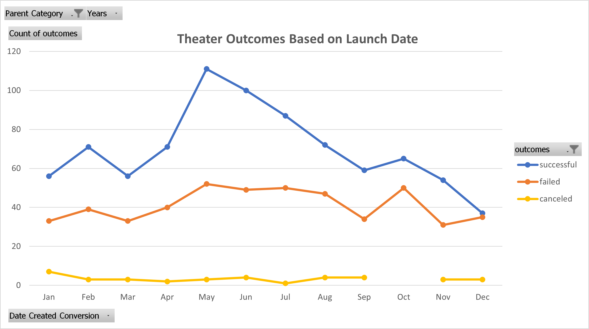
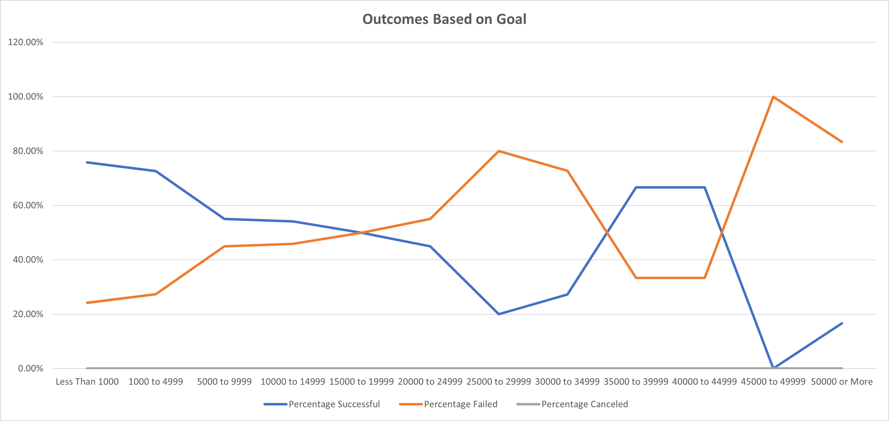

# Kickstarting with Excel
Performing analysis on Kickstarter sample data. 

## Overview of Project

### Purpose
To analyze how successful theater Kickstarter campaigns are, especially in relation to their launch dates and funding goals, so that potential Kickstarters can be advised appropriately. 

## Analysis and Challenges

### Analysis of Outcomes Based on Launch Date
The following graph comes from filtering the data set by category, and then filtering all data from the theater category further, comparing their final outcome and their initial launch date. 

From this chart, there is an optimistic trend for theater projects on kickstarter. There are always more successful theater projects than failed ones regardless of time of year. However, there is still a greater spike of success during the month of May, which slowly declines for the rest of the year. Additionally, there are very few cancelled projects in this category, with only a minor spike in January. 
For future projects, May or June, would be the best months to launch theater projects on Kickstarter. 

### Analysis of Outcomes Based on Goals
The following graph comes from filtering the data set by subcategory, and then filtering all data from the plays subcategory further, sorting the data points into ranges of their goal amounts and further divided by their outcome. The percentage of each outcome within their given ranges is displayed on the graph.

From this chart, we find a relatively downward trend in plays being successfully funded based on their funding goals. Relatively cheaper plays get funded at a higher rate compared to more expensive plays. 
Despite the percentage increase of successful Kickstarters with goals between $35,000 and $45,000, the number of data points at the higher range of this graph is very low compared to the lower end which makes it difficult to make any conclusions. 
For future projects, it is recommended to keep expenses below $5000 to ensure highest likelyhood of funding. 

### Challenges and Difficulties Encountered
When the data is filtered, holes emerge in the data. Specifically, down to the theater category and further filtered to the plays subcategory, information like the number of cancelled theater Kickstarters and plays with goals above $25000 have very low amounts of data points. These holes in the data were apparent on the presented graphs. In the case of lack of data points for plays with higher goal amounts, this seems to reduce the usefulness of the graph, and that was noted in the analysis.

## Results

- What are two conclusions you can draw about the Outcomes based on Launch Date?
** Theater Kickstarters are overall more likely to succeed than to fail.
** Theater Kickstarters are much more likely to succeed if they launch in May rather than any other month. 

- What can you conclude about the Outcomes based on Goals?
** Play Kickstarters are more likely to succeed with lower fundraising goals, especially below $5000. 

- What are some limitations of this dataset?
** With less than ten years of data, this data set seems small, especially when filtered down. 
** There could be outliers at the upper end of the data set. 

- What are some other possible tables and/or graphs that we could create?
** A table that calculated Standard Deviation and IQR of goal amounts, and a Box and Whisker graph could be helpful in identifying outliers and making more helpful analyses. 
